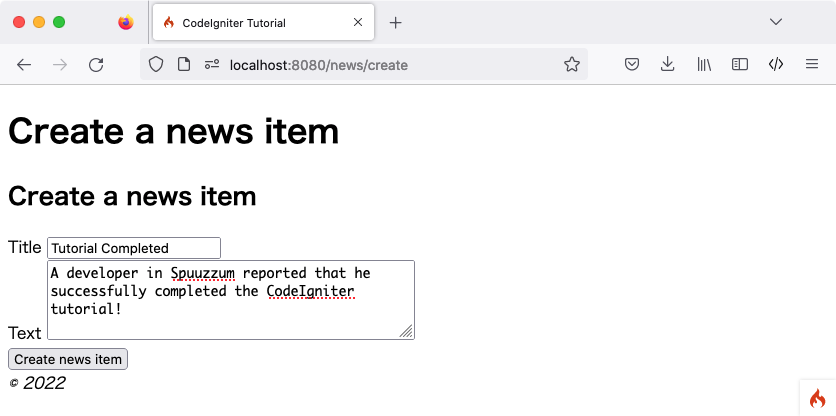
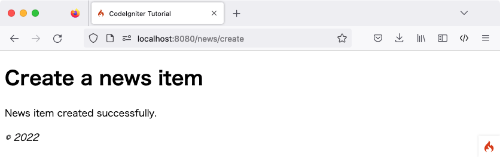

创建新闻条目
#################

.. contents::
    :local:
    :depth: 3

目前已掌握如何使用 CodeIgniter 从数据库读取数据，但尚未尝试写入。本节将扩展此前创建的新闻控制器和模型，以实现此功能。

启用 CSRF 过滤器
******************

在创建表单前，先启用 CSRF 保护。

打开 **app/Config/Filters.php** 文件，按如下方式更新 ``$methods`` 属性：

.. literalinclude:: create_news_items/001.php

此配置为所有 **POST** 请求启用了 CSRF 过滤器。更多关于 CSRF 保护的信息，请参阅 :doc:`Security <../../libraries/security>` 类文档。

.. warning:: 通常在使用 ``$methods`` 过滤器时，应禁用 :ref:`自动路由（传统版） <use-defined-routes-only>`，因为 :ref:`auto-routing-legacy` 允许通过任何 HTTP 方法访问控制器。如果使用了非预期的 HTTP 方法访问控制器，可能会绕过该过滤器。

添加路由规则
********************

向 CodeIgniter 应用添加新闻条目前，必须在 **app/Config/Routes.php** 文件中增加一条规则。确保文件中包含以下内容：

.. literalinclude:: create_news_items/004.php

``'news/new'`` 的路由指令需放在 ``'news/(:segment)'`` 之前，以确保能正确显示创建新闻的表单。

``$routes->post()`` 行定义了 POST 请求的路由。该路由仅匹配指向 **/news** 的 POST 请求，并将其映射到 ``News`` 类的 ``create()`` 方法。

关于不同路由类型的更多信息，请参阅 :ref:`defined-route-routing`。

创建表单
*************

创建 news/create 视图文件
============================

若要向数据库输入数据，需要创建一个用于输入信息的表单。这意味着需要一个包含两个字段（标题和文本）的表单。Slug 将根据模型中的标题自动生成。

在 **app/Views/news/create.php** 创建新视图：

.. literalinclude:: create_news_items/006.php

此处可能只有四处内容较为陌生：

使用 :php:func:`session()` 函数获取 Session 对象，并通过 ``session()->getFlashdata('error')`` 向用户显示 CSRF 保护相关的错误。不过默认情况下，若 CSRF 验证失败会抛出异常，因此该功能目前尚不可用。详见 :ref:`csrf-redirection-on-failure`。

由 :doc:`../../helpers/form_helper` 提供的 :php:func:`validation_list_errors()` 函数用于报告表单验证错误。

:php:func:`csrf_field()` 函数会创建一个包含 CSRF 令牌的隐藏输入框，有助于抵御常见攻击。

由 :doc:`../../helpers/form_helper` 提供的 :php:func:`set_value()` 函数用于在发生错误时显示之前的输入数据。

News 控制器
===============

回到 ``News`` 控制器。

添加 News::new() 以显示表单
-----------------------------------

首先，创建一个方法来显示前面创建的 HTML 表单。

.. literalinclude:: create_news_items/002.php

通过 :php:func:`helper()` 函数加载 :doc:`表单辅助函数 <../../helpers/form_helper>`。大多数辅助函数在使用前都必须先加载。

随后返回创建好的表单视图。

添加 News::create() 以创建新闻条目
----------------------------------------

接下来，创建一个方法用于处理提交的数据并创建新闻条目。

此方法主要执行以下三项操作：

1. 检查提交的数据是否通过验证规则。
2. 将新闻条目保存到数据库。
3. 返回成功页面。

.. literalinclude:: create_news_items/005.php

上述代码实现了大量功能：

获取数据
^^^^^^^^^^^^^^^^^

首先，使用框架在控制器中设置好的 :doc:`IncomingRequest <../../incoming/incomingrequest>` 对象 ``$this->request``。

从用户提交的 **POST** 数据中获取必要项，并存入 ``$data`` 变量。

验证数据
^^^^^^^^^^^^^^^^^

接着，利用控制器提供的 :ref:`validateData() <controller-validatedata>` 辅助函数验证提交的数据。本例中，标题和内容字段为必填项，且需满足特定长度。

如上所示，CodeIgniter 拥有强大的验证库。详情可参阅 :doc:`Validation 类 <../../libraries/validation>`。

如果验证失败，则调用刚才创建的 ``new()`` 方法并重新返回表单。

保存新闻条目
^^^^^^^^^^^^^^^^^^

若数据通过所有验证规则，则通过 :ref:`$this->validator->getValidated() <validation-getting-validated-data>` 获取验证后的数据，并存入 ``$post`` 变量。

随后加载并调用 ``NewsModel``，将新闻条目传递给模型。:ref:`model-save` 方法会根据数组中是否存在匹配主键的键值，自动处理记录的插入或更新。

此处包含一个新函数 :php:func:`url_title()`。该函数由 :doc:`URL 辅助函数 <../../helpers/url_helper>` 提供，用于处理传入的字符串，将所有空格替换为减号（``-``）并转换为小写，从而生成非常适合 URI 的 Slug。

返回成功页面
^^^^^^^^^^^^^^^^^^^

完成后，加载并返回视图文件以显示成功信息。在 **app/Views/news/success.php** 创建视图并编写成功提示。

内容可以很简单::

    
News item created successfully.

更新 NewsModel
******************

最后需要确保模型已配置妥当，以便正确保存数据。``save()`` 方法会根据是否存在主键，自动判断执行插入操作还是更新现有记录。在本例中，由于未传递 ``id`` 字段，模型将向 ``news`` 表插入新行。

然而，默认情况下模型中的插入和更新方法不会实际保存数据，因为它不知道哪些字段可以安全更新。需编辑 ``NewsModel``，在 ``$allowedFields`` 属性中提供可更新字段的列表。

.. literalinclude:: create_news_items/003.php

该属性现在包含了允许保存到数据库的字段。注意这里漏掉了 ``id``？这是因为 ``id`` 在数据库中是自增字段，几乎不需要手动操作。这有助于防止“批量赋值漏洞”。如果模型负责处理时间戳，也应将其排除在外。

创建新闻条目
******************

现在，在浏览器中访问本地开发环境，并在 URL 后添加 **/news/new**。尝试添加一些新闻并查看创建的各个页面。

恭喜
***************

你刚刚完成了第一个 CodeIgniter 4 应用！

下图展示了项目的 **app** 目录，以及所有新创建或修改过的文件。

.. code-block:: none

    app/
    ├── Config
    │   ├── Filters.php (已修改)
    │   └── Routes.php  (已修改)
    ├── Controllers
    │   ├── News.php
    │   └── Pages.php
    ├── Models
    │   └── NewsModel.php
    └── Views
        ├── news
        │   ├── create.php
        │   ├── index.php
        │   ├── success.php
        │   └── view.php
        ├── pages
        │   ├── about.php
        │   └── home.php
        └── templates
            ├── footer.php
            └── header.php
