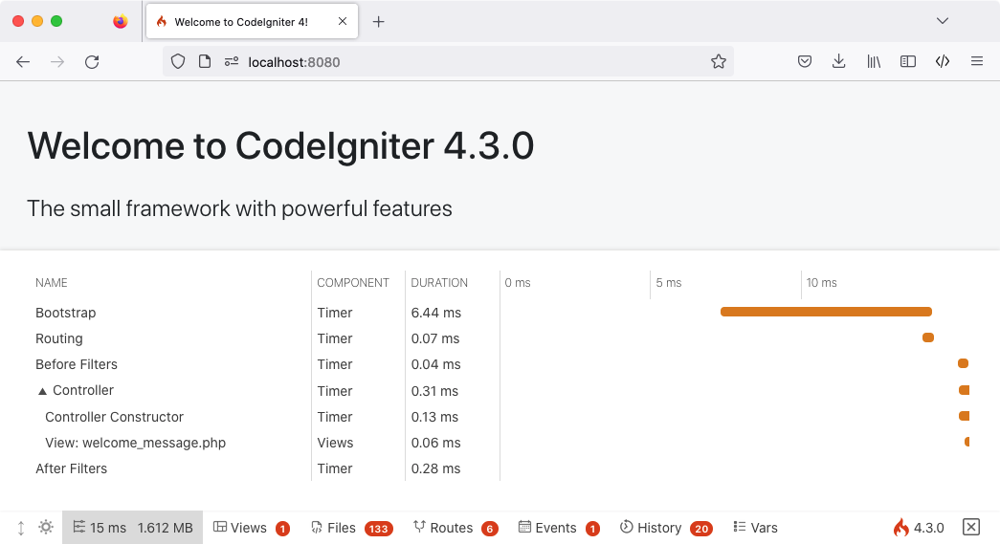
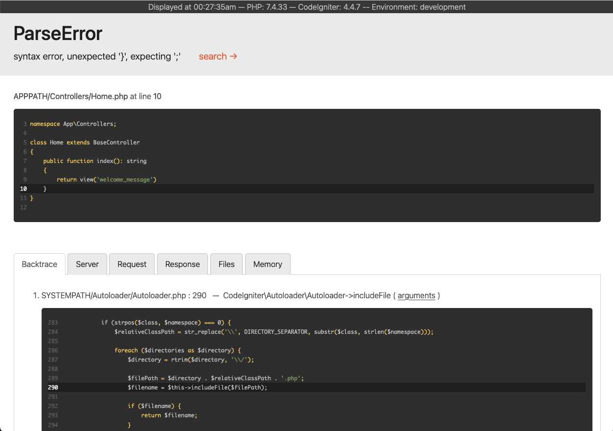

############################
构建第一个应用程序
############################

.. contents::
    :local:
    :depth: 2

概览
********

本教程旨在介绍 CodeIgniter4 框架及其 MVC 架构的基本原理，通过循序渐进的方式展示如何构建一个基础 CodeIgniter 应用。

如果不熟悉 PHP，建议在继续之前先查看 `W3Schools PHP 教程 <https://www.w3schools.com/php/default.asp>`_。

在本教程中，将构建一个 **基础新闻应用**。首先编写加载静态页面的代码；接着创建一个新闻板块，用于读取数据库中的新闻条目；最后添加一个表单，用于在数据库中创建新闻条目。

本教程主要关注以下内容：

-  MVC 基础知识
-  路由基础
-  表单验证
-  使用 CodeIgniter 模型进行基础数据库查询

整个教程分为几个页面，分别讲解 CodeIgniter 框架的部分功能：

-  简介（即本页）：概览教程内容，并指导下载和运行默认应用。
-  :doc:`静态页面 <static_pages>`：学习控制器、视图和路由的基础知识。
-  :doc:`新闻板块 <news_section>`：开始使用模型并进行基础数据库操作。
-  :doc:`创建新闻条目 <create_news_items>`：介绍高级数据库操作和表单验证。
-  :doc:`总结 <conclusion>`：提供进阶学习指引和其他资源。

祝你在探索 CodeIgniter 框架的过程中收获满满。

.. toctree::
    :hidden:
    :titlesonly:

    static_pages
    news_section
    create_news_items
    conclusion

快速上手
**********************

安装 CodeIgniter
======================

虽然可以从官网手动下载发布版，但本教程推荐通过 Composer 安装 AppStarter 软件包。在命令行中输入以下命令：

.. code-block:: console

    composer create-project codeigniter4/appstarter ci-news

这将创建一个名为 **ci-news** 的新文件夹，其中包含应用代码，而 CodeIgniter 框架则安装在 vendor 文件夹中。

.. _setting-development-mode:

设置开发模式
========================

CodeIgniter 默认以生产模式启动。这是一项安全特性，用于在应用上线后配置失误时保护站点安全。首先来调整这一设置。将 **env** 文件复制或重命名为 **.env** 并打开。

此文件包含服务器特定的设置。这意味着无需将任何敏感信息提交到版本控制系统。文件中已经包含了一些常用的设置项，只是都被注释掉了。找到 ``CI_ENVIRONMENT`` 所在行，取消注释并将 ``production`` 改为 ``development``::

    CI_ENVIRONMENT = development

运行开发服务器
==========================

设置完成后，即可在浏览器中查看应用。虽然可以使用 Apache、Nginx 等任何服务器，但 CodeIgniter 自带了一个简单命令，利用 PHP 内置服务器在开发环境下快速启动。在项目根目录下运行以下命令：

.. code-block:: console

    php spark serve

欢迎页面
****************

在浏览器中访问相应 URL，即可看到欢迎界面。现在尝试访问::

    http://localhost:8080

随后应看到如下页面：

.. image:: ../../images/welcome.png

这表明应用已正常运行，可以开始进行修改了。

调试
*********

调试工具栏
=============

切换到开发模式后，应用右下角会出现 CodeIgniter 火焰图标。点击即可打开调试工具栏。

该工具栏包含许多在开发过程中可参考的实用项目。它绝不会在生产环境中显示。点击底部的任意选项卡可查看详细信息。点击工具栏右侧的 X 可将其最小化为一个带火焰图标的小方块；再次点击即可重新展开。

错误页面
===========

此外，当程序遇到异常或其他错误时，CodeIgniter 会提供实用的错误页面。打开 **app/Controllers/Home.php** 并随意修改一行代码以制造错误（例如删除分号或大括号）。页面将显示如下：

请注意以下几点：

1. 将鼠标悬停在顶部的红色标题上会显示 **search** 链接，点击后将在新标签页中通过 DuckDuckGo.com 搜索该异常。
2. 点击 Backtrace 中任一行的 **arguments** 链接，可展开查看传递给该函数的参数列表。

其他信息在看到页面时应一目了然。

了解如何入门和调试后，现在开始构建这个小型新闻应用。
