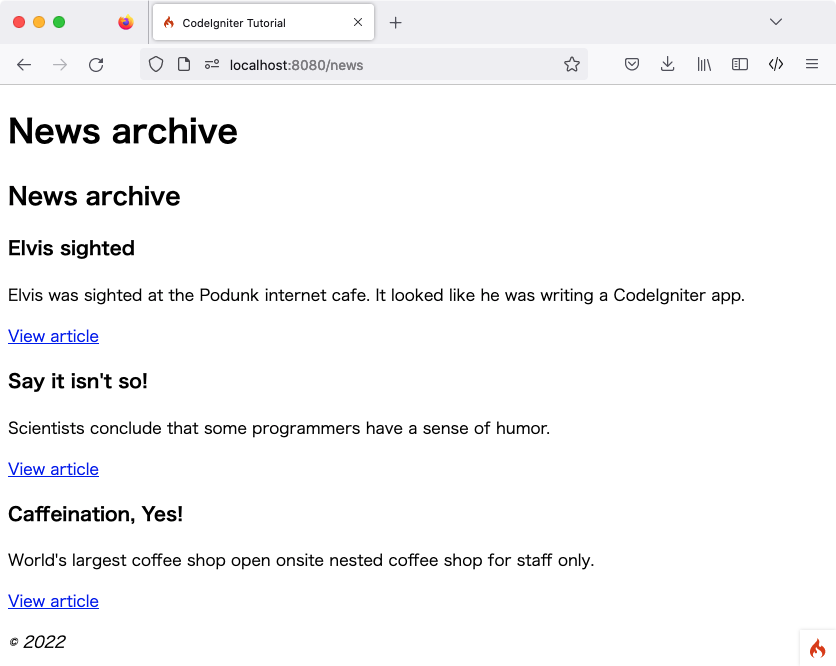

新闻版块
############

.. contents::
    :local:
    :depth: 2

上一节通过编写一个引用静态页面的类，了解了框架的一些基本概念，并利用自定义路由规则优化了 URI。现在开始引入动态内容并使用数据库。

创建数据库
******************************

安装 CodeIgniter 时，应已按照 :ref:`需求 <requirements-supported-databases>` 设置好合适的数据库。本教程提供 MySQL 数据库的 SQL 代码，并假设已准备好用于执行数据库命令的客户端（如 mysql、MySQL Workbench 或 phpMyAdmin）。

需创建一个名为 ``ci4tutorial`` 的数据库用于本教程，并配置 CodeIgniter 调用该数据库。

使用数据库客户端连接数据库并运行以下 SQL 命令（MySQL）::

    CREATE TABLE news (
        id INT UNSIGNED NOT NULL AUTO_INCREMENT,
        title VARCHAR(128) NOT NULL,
        slug VARCHAR(128) NOT NULL,
        body TEXT NOT NULL,
        PRIMARY KEY (id),
        UNIQUE slug (slug)
    );

同时添加一些种子记录。目前仅展示创建表所需的 SQL 语句，不过在熟悉 CodeIgniter 后，可以通过编程方式实现。稍后可阅读 :doc:`数据库迁移 <../../dbmgmt/migration>` 和 :doc:`数据填充 <../../dbmgmt/seeds>` 了解如何构建更高效的数据库方案。

补充一点：在 Web 发布语境下，“slug” 是指用于 URL 中标识并描述资源的、对用户和 SEO 友好的简短文本。

种子记录示例如下::

    INSERT INTO news VALUES
    (1,'Elvis sighted','elvis-sighted','Elvis was sighted at the Podunk internet cafe. It looked like he was writing a CodeIgniter app.'),
    (2,'Say it isn\'t so!','say-it-isnt-so','Scientists conclude that some programmers have a sense of humor.'),
    (3,'Caffeination, Yes!','caffeination-yes','World\'s largest coffee shop open onsite nested coffee shop for staff only.');

连接数据库
************************

安装 CodeIgniter 时创建的本地配置文件 **.env** 中，应取消数据库属性设置的注释，并根据所用数据库进行正确配置。确保已按照 :doc:`../../database/configuration` 中的说明配置好数据库::

    database.default.hostname = localhost
    database.default.database = ci4tutorial
    database.default.username = root
    database.default.password = root
    database.default.DBDriver = MySQLi

设置模型
*********************

数据库操作不应直接写在控制器中，而应放入模型，以便日后复用。模型用于获取、插入和更新数据库或其他数据存储中的信息。有关详细信息，请参阅 :doc:`../../models/model`。

创建 NewsModel
================

进入 **app/Models** 目录，新建 **NewsModel.php** 文件并添加以下代码。

.. literalinclude:: news_section/001.php

这段代码与之前编写的控制器代码类似。它通过继承 ``CodeIgniter\Model`` 并加载数据库类来创建新模型。这样即可通过 ``$this->db`` 对象使用数据库类。

添加 NewsModel::getNews() 方法
===============================

数据库和模型设置完成后，需要一个从数据库获取所有文章的方法。为此，在 ``CodeIgniter\Model`` 中使用了 CodeIgniter 内置的数据库抽象层——:doc:`查询构建器 <../../database/query_builder>`。这使得只需编写一次“查询”，即可在 :doc:`所有受支持的数据库系统 <../../intro/requirements>` 上运行。Model 类还简化了查询构建器的使用，并提供了额外的工具来简化数据操作。将以下代码添加到模型中。

.. literalinclude:: news_section/002.php
    :lines: 11-23

通过这段代码可以执行两种不同的查询：获取所有新闻记录，或根据 Slug 获取特定新闻条目。你可能注意到 ``$slug`` 变量在运行查询前没有经过转义，这是因为 :doc:`查询构建器 <../../database/query_builder>` 已自动处理。

此处使用的 ``findAll()`` 和 ``first()`` 方法由 ``CodeIgniter\Model`` 类提供。它们会根据 ``NewsModel`` 类中设置的 ``$table`` 属性自动识别要操作的表。这些辅助方法利用查询构建器对当前表运行命令，并按选定格式返回结果数组。在本例中，``findAll()`` 返回一个二维数组。

显示新闻
****************

查询逻辑编写完成后，需将模型与显示新闻条目的视图关联。虽然可以在之前创建的 ``Pages`` 控制器中实现，但为了清晰起见，这里定义一个新的 ``News`` 控制器。

添加路由规则
====================

修改 **app/Config/Routes.php** 文件如下：

.. literalinclude:: news_section/008.php

这能确保请求被分发到 ``News`` 控制器，而不是直接进入 ``Pages`` 控制器。第二行 ``$routes->get()`` 将带有 Slug 的 URI 路由到 ``News`` 控制器的 ``show()`` 方法。

创建 News 控制器
======================

在 **app/Controllers/News.php** 创建新控制器。

.. literalinclude:: news_section/003.php

观察代码可以发现，它与之前创建的文件非常相似。首先，它继承了 ``BaseController`` （后者继承自 CodeIgniter 核心类 ``Controller``）。该核心类提供了一些辅助方法，并确保可以访问当前的 ``Request`` 和 ``Response`` 对象，以及用于将信息保存到磁盘的 ``Logger`` 类。

接下来定义了两个方法：一个用于查看所有新闻条目，另一个用于查看特定新闻。

随后，使用 :php:func:`model()` 函数创建 ``NewsModel`` 实例。这是一个全局辅助函数。详情请参阅 :doc:`../../general/common_functions`。如果不使用该函数，也可以写成 ``$model = new NewsModel();``。

在第二个方法中，``$slug`` 变量被传递给模型方法，模型通过此 Slug 识别并返回对应的新闻条目。

完善 News::index() 方法
=============================

现在控制器已通过模型获取了数据，但尚未展示。下一步是将数据传递给视图。修改 ``index()`` 方法如下：

.. literalinclude:: news_section/004.php

上述代码从模型中获取所有新闻记录并将其赋值给变量。同时将标题赋值给 ``$data['title']``，并将所有数据传递给视图。现在需要创建一个视图来渲染这些新闻条目。

创建 news/index 视图文件
===========================

创建 **app/Views/news/index.php** 并添加以下代码。

.. literalinclude:: news_section/005.php

.. note:: 再次使用 :php:func:`esc()` 来防止 XSS 攻击。
    不过这次增加了第二个参数 "url"。这是因为攻击模式会随输出内容的上下文环境而变化。

此处通过循环遍历并显示每条新闻项目。可以看到，模板由 PHP 和 HTML 混写而成。如果倾向于使用模板语言，可以使用 CodeIgniter 的 :doc:`视图解析器 </outgoing/view_parser>` 或第三方解析器。

完善 News::show() 方法
============================

新闻列表页已完成，但还缺少显示单条新闻的页面。之前创建的模型可以直接支持此功能。只需在控制器中添加少量代码并创建新视图即可。回到 ``News`` 控制器，使用以下内容更新 ``show()`` 方法：

.. literalinclude:: news_section/006.php

别忘了添加 ``use CodeIgniter\Exceptions\PageNotFoundException;`` 来导入 ``PageNotFoundException`` 类。

这里不再调用无参数的 ``getNews()`` 方法，而是传递 ``$slug`` 变量，从而返回特定的新闻条目。

创建 news/view 视图文件
==========================

最后一步是在 **app/Views/news/view.php** 创建对应的视图。在该文件中加入以下代码。

.. literalinclude:: news_section/007.php

在浏览器中访问新闻页面（例如 **localhost:8080/news**），即可看到新闻列表，点击每条新闻对应的链接可查看全文。

