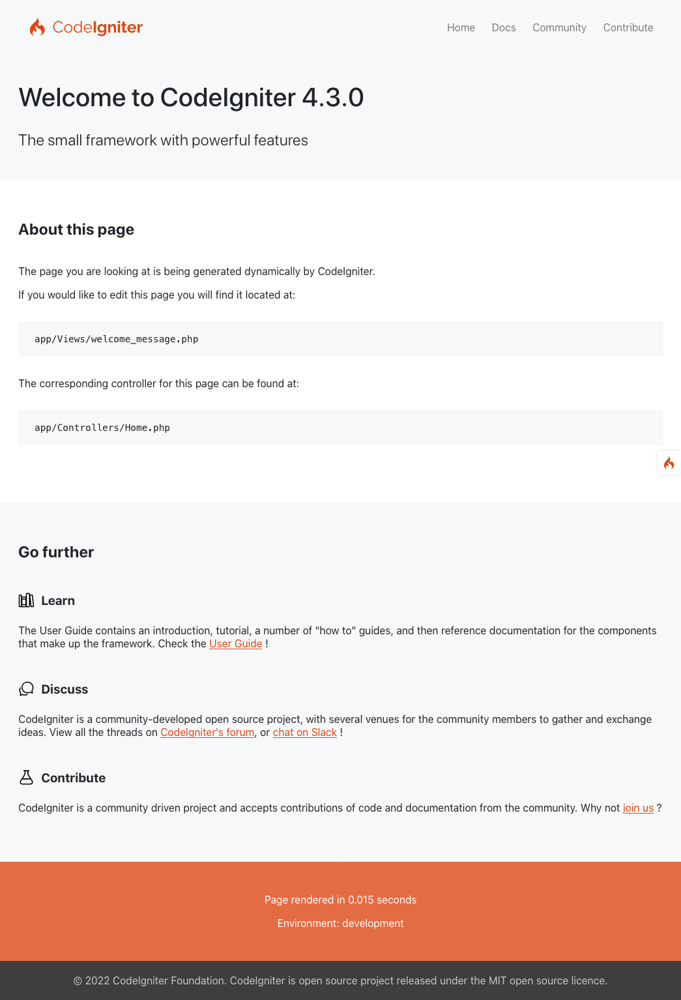

###############
故障排除
###############

以下是一些常见的安装问题，以及对应的解决方法。

.. contents::
    :local:
    :depth: 2

如何确认安装是否正常工作？
---------------------------------------

在项目根目录的命令行中执行：

.. code-block:: console

    php spark serve

然后在浏览器中访问 ``http://localhost:8080``，应该会显示默认的欢迎页面：

|CodeIgniter4 Welcome|

我必须在 URL 中包含 index.php
-------------------------------------

如果类似 ``/mypage/find/apple`` 的 URL 无法访问，但 ``/index.php/mypage/find/apple`` 可以正常工作，通常说明 **.htaccess** 规则（Apache）没有正确配置，或者 Apache 的 **httpd.conf** 中 ``mod_rewrite`` 扩展被注释掉了。
请参阅 :ref:`urls-remove-index-php`。

只会加载默认页面
---------------------------

如果无论在 URL 中输入什么内容，都只会加载默认页面，可能是你的服务器不支持用于生成搜索引擎友好 URL 所需的 REQUEST_URI 变量。

第一步，打开 **app/Config/App.php** 文件，查找 URI Protocol 相关设置。文件中会建议你尝试几个备用配置。
如果在尝试之后仍然无法工作，就需要强制 CodeIgniter 在 URL 中添加一个问号（``?``）。

为此，请打开 **app/Config/App.php** 文件，将以下内容：

.. literalinclude:: troubleshooting/001.php

修改为：

.. literalinclude:: troubleshooting/002.php

No input file specified
-----------------------

如果看到 “No input file specified” 错误，请尝试按如下方式修改重写规则（在 ``index.php`` 后添加 ``?``）：

.. code-block:: apache

    RewriteRule ^([\s\S]*)$ index.php?/$1 [L,NC,QSA]

应用在本地运行正常，但在生产服务器上不工作
----------------------------------------------------------

请确认文件夹和文件名的大小写与代码中的引用完全一致。

许多开发者在 Windows 或 macOS 的大小写不敏感文件系统上进行开发。
然而，大多数服务器环境使用的是大小写敏感的文件系统。

例如，当你有 **app/Controllers/Product.php** 文件时，短类名必须使用 ``Product``，而不是 ``product``。

如果文件名的大小写不正确，服务器将无法找到该文件。

教程中的所有页面都返回 404 错误 :(
-------------------------------------------

你无法使用 PHP 内置的 Web 服务器来完成教程。
它不支持 **.htaccess** 文件，因此无法正确的路由请求。

解决方法是：使用 Apache 来提供站点服务，或者使用 CodeIgniter 内置的等效方式，在项目根目录运行 ``php spark serve``。

为什么会出现毫无帮助的 “Whoops!” 页面？
----------------------------------------

如果你的应用显示一个包含 “Whoops!” 的页面，并带有
“We seem to have hit a snag. Please try again later...” 这行文字，

这表示当前处于生产模式，并且发生了一个不可恢复的错误。
出于安全考虑，这类错误不会直接展示给 Web 应用的访问者。

你可以在日志文件中查看具体错误。请参阅下面的 `CodeIgniter 错误日志`_。

如果你在开发过程中遇到该页面，应将环境切换为 “development”（在 **.env** 中设置）。
更多信息请参阅 :ref:`setting-development-mode`。
完成后重新加载页面，即可看到错误信息和回溯信息。

CodeIgniter 错误日志
----------------------

请参阅 :ref:`codeigniter-error-logs`。
