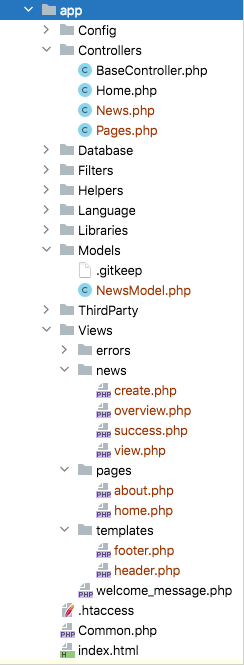

创建新闻
#################

.. contents::
    :local:
    :depth: 2

你现在已经知道如何使用 CodeIgniter 从数据库中读取数据,但是你还没有将任何信息写入数据库。在本节中,你将扩展之前创建的新闻控制器和模型,以包括此功能。

启用 CSRF 过滤器
******************

在创建表单之前,让我们启用 CSRF 保护。

打开 **app/Config/Filters.php** 文件,并如下更新 ``$methods`` 属性:

.. literalinclude:: create_news_items/001.php

它将配置 CSRF 过滤器以对所有 **POST** 请求启用。
你可以在 :doc:`Security <../libraries/security>` 库中阅读更多关于 CSRF 保护的信息。

.. warning:: 一般来说,如果你使用 ``$methods`` 过滤器,你应该 :ref:`禁用自动路由(传统) <use-defined-routes-only>`,
    因为 :ref:`auto-routing-legacy` 允许任何 HTTP 方法访问控制器。
    使用你不期望的方法访问控制器可能会绕过过滤器。

创建表单
*************

视图
====

为了将数据输入数据库,你需要创建一个表单,在表单中你可以输入要存储的信息。这意味着你需要一个带有两个字段的表单,一个用于标题,一个用于文本。我们会在模型中从标题中派生 slug。在 **app/Views/news/create.php** 中创建一个新的视图::

    <h2><?= esc($title) ?></h2>

    <?= session()->getFlashdata('error') ?>
    <?= validation_list_errors() ?>

    <form action="/news/create" method="post">
        <?= csrf_field() ?>

        <label for="title">标题</label>
        <input type="input" name="title" value="<?= set_value('title') ?>">
         

        <label for="body">文本</label>
        <textarea name="body" cols="45" rows="4"><?= set_value('body') ?></textarea>
         

        <input type="submit" name="submit" value="创建新闻">
    </form>

这里可能只有四件事看起来不太熟悉。

:php:func:`session()` 函数用于获取 Session 对象,``session()->getFlashdata('error')`` 用于向用户显示与 CSRF 保护相关的错误。
但是,默认情况下,如果 CSRF 验证检查失败,将抛出异常,所以它现在还不起作用。有关更多信息,请参阅 :ref:`csrf-redirection-on-failure`。

:php:func:`validation_list_errors()` 函数由 :doc:`../helpers/form_helper` 提供,用于报告与表单验证相关的错误。

:php:func:`csrf_field()` 函数创建一个带有 CSRF 令牌的隐藏输入,有助于防止一些常见攻击。

:php:func:`set_value()` 函数由 :doc:`../helpers/form_helper` 提供,用于在发生错误时显示旧输入数据。

控制器
==========

返回你的 **News** 控制器。你将在此做两件事,检查表单是否已提交以及提交的数据是否通过了验证规则。
你将使用 :ref:`Controller 中的 validation 方法 <controller-validatedata>` 来完成此操作。

.. literalinclude:: create_news_items/002.php

上面的代码添加了很多功能。

首先,我们使用 :php:func:`helper()` 函数加载 :doc:`表单辅助函数 <../helpers/form_helper>`。
大多数辅助函数需要在使用前加载辅助函数。

接下来,我们使用 :doc:`IncomingRequest <../incoming/incomingrequest>` 对象 ``$this->request`` 检查我们是否处理 **POST** 请求。
它由框架在控制器中设置。
:ref:`IncomingRequest::is() <incomingrequest-is>` 方法检查请求的类型。
由于 **create()** 端点的路由处理 **GET** 和 **POST** 请求,所以如果请求不是 POST,我们可以安全地假设它是 GET 类型,
表单被加载并返回以显示。

然后,我们从 POST 数据中获取用户提交的必要项,并将它们设置在 ``$post`` 变量中。
我们还使用 :doc:`IncomingRequest <../incoming/incomingrequest>` 对象 ``$this->request``。

之后,使用 Controller 提供的辅助函数 :ref:`validateData() <controller-validatedata>` 来验证 ``$post`` 数据。
在这种情况下,标题和正文字段是必需的且长度在特定范围内。
CodeIgniter 拥有强大的验证库,如上所示。你可以阅读更多关于 :doc:`验证库 <../libraries/validation>` 的信息。

如果验证失败,表单将被加载并返回以显示。

如果验证通过了所有规则,**NewsModel** 将被加载并调用。这负责将新闻项传递到模型中。:ref:`model-save` 方法会自动插入或更新记录,这取决于它是否找到与主键匹配的数组键。

这包含一个新函数 :php:func:`url_title()`。这个函数由 :doc:`URL 辅助函数 <../helpers/url_helper>` 提供 -
它会剥离你传递给它的字符串,用破折号 (``-``) 替换所有空格,并确保所有内容都是小写。
这会给你一个不错的 slug,非常适合创建 URI。

之后,视图文件被加载并返回以显示成功消息。在 **app/Views/news/success.php** 中创建一个视图,并编写成功消息。

这可以简单地写成::

    
新闻项目创建成功。

更新模型
**************

唯一剩下的就是确保你的模型设置为允许数据被正确保存。
在使用的 ``save()`` 方法将确定信息应插入还是如果行已经存在则应更新,这取决于主键的存在。
在这种情况下,没有传递 ``id`` 字段给它,所以它会在它的表格 **news** 中插入新行。

但是,默认情况下,模型中的 insert 和 update 方法实际上不会保存任何数据,因为它不知道哪些字段是安全更新的。
编辑 **NewsModel** 以在 ``$allowedFields`` 属性中为其提供可更新字段的列表。

.. literalinclude:: create_news_items/003.php

这个新属性现在包含我们允许保存到数据库的字段。请注意,我们排除了 ``id`` 字段?这是因为你几乎永远不需要这样做,因为它是一个数据库中的自动递增字段。
这有助于防止批量分配漏洞。如果你的模型处理了时间戳,你也会排除它们。

路由
*******

在你可以开始将新闻添加到 CodeIgniter 应用程序之前,你必须在 **app/Config/Routes.php** 文件中添加一个额外的规则。确保你的文件包含以下内容。这可以确保 CodeIgniter 将 ``create()`` 视为一个方法,而不是新闻项的 slug。你可以在 :doc:`../incoming/routing` 中阅读有关不同路由类型的更多信息。

.. literalinclude:: create_news_items/004.php

现在指向你安装了 CodeIgniter 的本地开发环境的浏览器,并在 URL 中添加 ``/news/create``。
添加一些新闻并查看你创建的不同页面。

.. image:: ../images/tutorial3.png
    :align: center
    :height: 415px
    :width: 45%

.. image:: ../images/tutorial4.png
    :align: center
    :height: 415px
    :width: 45%

恭喜
***************

你刚刚完成了你的第一个 CodeIgniter4 应用程序!

下面的图像显示了你的项目的 **app** 文件夹,
你创建的所有文件显示为红色。
两个已修改的配置文件(**Config/Routes.php** & **Config/Filters.php**)未显示。

