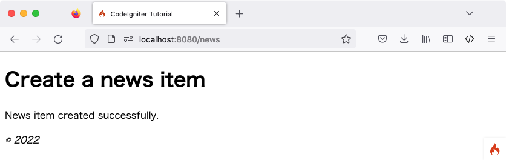

创建新闻
#################

.. contents::
    :local:
    :depth: 3

你现在已经知道如何使用 CodeIgniter 从数据库中读取数据,但是你还没有将任何信息写入数据库。在本节中,你将扩展之前创建的新闻控制器和模型,以包括此功能。

启用 CSRF 过滤器
******************

在创建表单之前,让我们启用 CSRF 保护。

打开 **app/Config/Filters.php** 文件,并如下更新 ``$methods`` 属性:

.. literalinclude:: create_news_items/001.php

它将配置 CSRF 过滤器以对所有 **POST** 请求启用。
你可以在 :doc:`Security <../libraries/security>` 库中阅读更多关于 CSRF 保护的信息。

.. warning:: 一般来说,如果你使用 ``$methods`` 过滤器,你应该 :ref:`禁用自动路由(传统) <use-defined-routes-only>`,
    因为 :ref:`auto-routing-legacy` 允许任何 HTTP 方法访问控制器。
    使用你不期望的方法访问控制器可能会绕过过滤器。

添加路由规则
********************

在你开始向 CodeIgniter 应用程序中添加新闻项目之前，你需要在 **app/Config/Routes.php** 文件中添加一个额外的规则。确保你的文件包含以下内容：

.. literalinclude:: create_news_items/004.php

``'news/new'`` 的路由指令放置在 ``'news/(:segment)'`` 的指令之前，以确保显示创建新闻项目的表单。

``$routes->post()`` 行定义了一个 POST 请求的路由器。它仅匹配 URI 路径 **/news** 的 POST 请求，并映射到 ``News`` 类的 ``create()`` 方法。

你可以在 :ref:`defined-route-routing` 中了解更多关于不同路由类型的信息。

创建表单
*************

创建 news/create 视图文件
============================

为了将数据输入数据库,你需要创建一个表单,在表单中你可以输入要存储的信息。这意味着你需要一个带有两个字段的表单,一个用于标题,一个用于文本。我们会在模型中从标题中派生 slug。

在 **app/Views/news/create.php** 中创建一个新的视图:

.. literalinclude:: create_news_items/006.php

这里可能只有四件事看起来不太熟悉。

:php:func:`session()` 函数用于获取 Session 对象, ``session()->getFlashdata('error')`` 用于向用户显示与 CSRF 保护相关的错误。
但是,默认情况下,如果 CSRF 验证检查失败,将抛出异常,所以它现在还不起作用。有关更多信息,请参阅 :ref:`csrf-redirection-on-failure`。

:php:func:`validation_list_errors()` 函数由 :doc:`../helpers/form_helper` 提供,用于报告与表单验证相关的错误。

:php:func:`csrf_field()` 函数创建一个带有 CSRF 令牌的隐藏输入,有助于防止一些常见攻击。

:php:func:`set_value()` 函数由 :doc:`../helpers/form_helper` 提供,用于在发生错误时显示旧输入数据。

News 控制器
===============

返回到你的 ``News`` 控制器。

添加 News::new() 方法以显示表单
-----------------------------------

首先，创建一个方法来显示你创建的 HTML 表单。

.. literalinclude:: create_news_items/002.php

我们使用 :php:func:`helper()` 函数加载 :doc:`Form 辅助函数 <../helpers/form_helper>`。大多数辅助函数在使用之前都需要加载辅助函数。

然后返回创建的表单视图。

添加 News::create() 以创建新闻项目
----------------------------------------

接下来，创建一个方法来根据提交的数据创建新闻项目。

在这里，你将完成三件事：

1. 检查提交的数据是否通过了验证规则。
2. 将新闻项目保存到数据库中。
3. 返回一个成功页面。

.. literalinclude:: create_news_items/005.php

上面的代码添加了很多功能。

获取数据
^^^^^^^^^^^^^^^^^

首先，我们使用由框架在控制器中设置的 :doc:`IncomingRequest <../incoming/incomingrequest>` 对象 ``$this->request``。

我们从用户的 **POST** 数据中获取必要的项目，并将它们设置在 ``$data`` 变量中。

验证数据
^^^^^^^^^^^^^^^^^

接下来，你将使用由 Controller 提供的辅助函数 :ref:`validateData() <controller-validatedata>` 来验证提交的数据。在这种情况下，标题和正文字段是必需的，并且具有特定的长度。

如上所示，CodeIgniter 拥有一个强大的验证库。你可以阅读更多关于 :doc:`验证库 <../libraries/validation>` 的信息。

如果验证失败，我们调用刚刚创建的 ``new()`` 方法并返回 HTML 表单。

保存新闻项目
^^^^^^^^^^^^^^^^^^

如果验证通过了所有规则，我们通过 :ref:`$this->validator->getValidated() <validation-getting-validated-data>` 获取验证后的数据，并将其设置在 ``$post`` 变量中。

加载并调用 ``NewsModel``。这将负责将新闻项目传递给模型。根据是否找到与主键匹配的数组键，:ref:`model-save` 方法会自动处理插入或更新记录。

这包含一个新函数 :php:func:`url_title()`。这个函数由 :doc:`URL 辅助函数 <../helpers/url_helper>` 提供 -
它会剥离你传递给它的字符串,用破折号 (``-``) 替换所有空格,并确保所有内容都是小写。
这会给你一个不错的 slug,非常适合创建 URI。

返回成功页面
^^^^^^^^^^^^^^^^^^^

之后,视图文件被加载并返回以显示成功消息。在 **app/Views/news/success.php** 中创建一个视图,并编写成功消息。

这可以简单地写成::

    
新闻项目创建成功。

更新 NewsModel
**************

唯一剩下的就是确保你的模型设置为允许数据被正确保存。
在使用的 ``save()`` 方法将确定信息应插入还是如果行已经存在则应更新,这取决于主键的存在。
在这种情况下,没有传递 ``id`` 字段给它,所以它会在它的表格 ``news`` 中插入新行。

但是,默认情况下,模型中的 insert 和 update 方法实际上不会保存任何数据,因为它不知道哪些字段是安全更新的。
编辑 ``NewsModel`` 以在 ``$allowedFields`` 属性中为其提供可更新字段的列表。

.. literalinclude:: create_news_items/003.php

这个新属性现在包含我们允许保存到数据库的字段。请注意,我们排除了 ``id`` 字段?这是因为你几乎永远不需要这样做,因为它是一个数据库中的自动递增字段。
这有助于防止批量分配漏洞。如果你的模型处理了时间戳,你也会排除它们。

创建新闻项目
******************

现在指向你安装了 CodeIgniter 的本地开发环境的浏览器,并在 URL 中添加 **/news/new**。
添加一些新闻并查看你创建的不同页面。

.. image:: ../images/tutorial3.png
    :align: center
    :height: 415px
    :width: 45%

恭喜
***************

你刚刚完成了你的第一个 CodeIgniter4 应用程序!

下面的图表显示了你的项目的 **app** 文件夹，其中包含你创建或修改的所有文件。

.. code-block:: none

    app/
    ├── Config
    │   ├── Filters.php (已修改)
    │   └── Routes.php  (已修改)
    ├── Controllers
    │   ├── News.php
    │   └── Pages.php
    ├── Models
    │   └── NewsModel.php
    └── Views
        ├── news
        │   ├── create.php
        │   ├── index.php
        │   ├── success.php
        │   └── view.php
        ├── pages
        │   ├── about.php
        │   └── home.php
        └── templates
            ├── footer.php
            └── header.php
