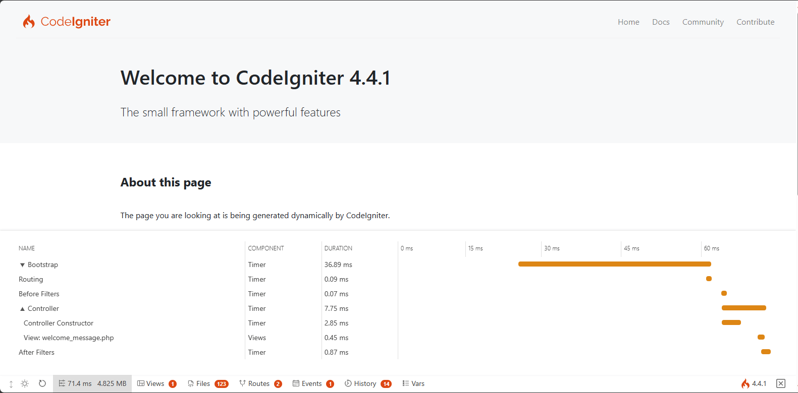

############################
构建你的第一个应用程序
############################

.. contents::
    :local:
    :depth: 2

概述
********

本教程旨在向你介绍 CodeIgniter4 框架以及 MVC 架构的基本原则。它将以一步一步的方式向你展示一个基本的 CodeIgniter 应用程序是如何构建的。

如果你不熟悉 PHP,我们建议你在继续之前先查看
`W3Schools PHP 教程 <https://www.w3schools.com/php/default.asp>`_。

在本教程中,你将创建一个 **基本的新闻应用程序**。你将从编写能够加载静态页面的代码开始。接下来,你将创建一个新闻部分,它从数据库中读取新闻条目。
最后,你将添加一个表单以在数据库中创建新闻条目。

本教程将主要关注:

- Model-View-Controller 基础知识
- 路由基础知识
- 表单验证
- 使用 CodeIgniter 的 Model 执行基本数据库查询

整个教程分成几个页面,每个页面解释 CodeIgniter 框架的一小部分功能。你将按照以下页面进行操作:

- 简介,本页面,概述你可以期待的内容,并获取默认应用程序下载并运行。
- :doc:`静态页面 <static_pages>`,将教你控制器、视图和路由的基础知识。
- :doc:`新闻部分 <news_section>`,你将开始使用模型并执行一些基本的数据库操作。
- :doc:`创建新闻条目 <create_news_items>`,将介绍更高级的数据库操作和表单验证。
- :doc:`结束语 <conclusion>`,将为你提供一些进一步阅读和其他资源的指导。

享受你对 CodeIgniter 框架的探索。

.. toctree::
    :hidden:
    :titlesonly:

    static_pages
    news_section
    create_news_items
    conclusion

启动并运行
**********************

安装 CodeIgniter
======================

你可以从网站手动下载版本,但是对于本教程,我们将使用推荐的方法,通过 Composer 安装 AppStarter 包。
在命令行输入以下命令::

    > composer create-project codeigniter4/appstarter ci-news

这将创建一个新文件夹 **ci-news**,其中包含你的应用程序代码,CodeIgniter 安装在 vendor 文件夹中。

.. _setting-development-mode:

设置开发模式
========================

默认情况下,CodeIgniter 以生产模式启动。这是一个安全特性,以防止在站点上线后设置被搞乱。
所以首先让我们解决这个问题。复制或重命名 ``env`` 文件为 ``.env``。打开它。

此文件包含服务器特定的设置。这意味着你永远不需要将任何敏感信息提交到版本控制系统。
它已经包含一些你想要输入的常见设置,不过都是注释掉的。因此,取消注释带有 ``CI_ENVIRONMENT`` 的那行,并将 ``production`` 更改为 ``development``::

    CI_ENVIRONMENT = development

运行开发服务器
==========================

搞定这些后,是时候在浏览器中查看你的应用程序了。你可以通过任何你选择的服务器提供服务,比如 Apache、Nginx 等,但是 CodeIgniter 提供了一个简单的命令,利用 PHP 的内置服务器快速在你的开发机器上启动并运行。在项目的根目录下在命令行输入以下命令::

    > php spark serve

欢迎页面
******************

现在将浏览器指向正确的 URL,你将看到欢迎屏幕。
现在通过访问以下 URL 尝试一下::

    http://localhost:8080

你应该会看到以下页面:

.. image:: ../images/welcome.png

这意味着你的应用程序可以工作了,你可以开始对其进行更改了。

调试
*********

调试工具栏
=============

现在你处于开发模式,你将在应用程序的右下角看到 CodeIgniter 火焰图标。点击它,你将看到调试工具栏。

此工具栏包含许多在开发期间可以参考的有用项目。
这在生产环境中永远不会显示。点击底部任意标签将弹出额外信息。点击工具栏右侧的 X 会将其最小化为一个小正方形,带有 CodeIgniter 火焰图标。如果单击该图标,工具栏将再次显示。

错误页面
===========

除此之外,如果在程序中遇到异常或其他错误,CodeIgniter 还具有一些有用的错误页面。打开 **app/Controllers/Home.php** 并更改某些行以生成错误(删除分号或大括号应该可以起作用!)。你将看到一个类似下面的页面:

.. image:: ../images/error.png

这里有几件事需要注意:

1. 将鼠标悬停在顶部的红色标题上会显示一个 **搜索** 链接,它会在新标签页中打开 DuckDuckGo.com 并搜索异常。
2. 在 Backtrace 中的任意一行上单击 **arguments** 链接会展开一个传入该函数调用的参数列表。

当你看到它时,其他所有内容都应该很清楚。

现在我们知道如何开始和如何进行简单的调试,让我们开始构建这个小新闻应用程序吧。
