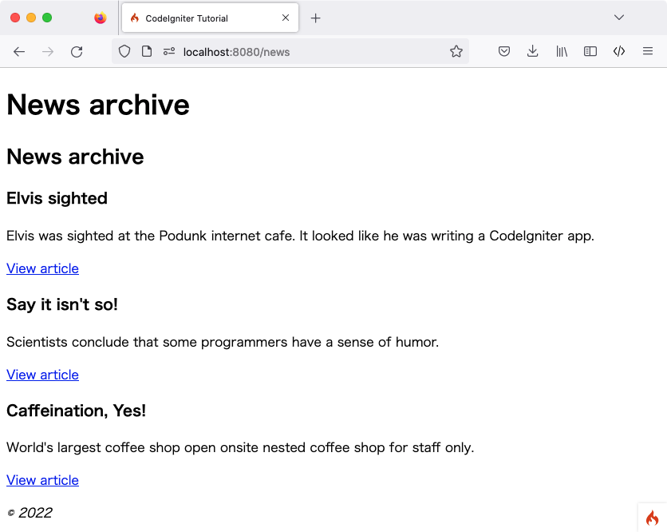

新闻部分
############

.. contents::
    :local:
    :depth: 2

在最后一节中,我们通过编写引用静态页面的类来概述了框架的一些基本概念。我们通过添加自定义路由规则来清理 URI。现在是时候引入动态内容并开始使用数据库了。

建立教程所需的数据库
******************************

CodeIgniter 安装假定你已经按 :ref:`要求 <requirements-supported-databases>` 设置了合适的数据库。
在本教程中,我们为 MySQL 数据库提供了 SQL 代码,并且我们还假设你有合适的客户端来发出数据库命令(mysql、MySQL Workbench 或 phpMyAdmin)。

你需要为本教程创建一个数据库 ``ci4tutorial``,然后配置 CodeIgniter 来使用它。

使用数据库客户端,连接到你的数据库并运行以下 SQL 命令(MySQL)::

    CREATE TABLE news (
        id INT UNSIGNED NOT NULL AUTO_INCREMENT,
        title VARCHAR(128) NOT NULL,
        slug VARCHAR(128) NOT NULL,
        body TEXT NOT NULL,
        PRIMARY KEY (id),
        UNIQUE slug (slug)
    );

此外,添加一些种子记录。现在,我们只向你展示创建表所需的 SQL 语句,但是你应该意识到,一旦对 CodeIgniter 更熟悉,就可以以编程方式完成此操作;稍后,你可以阅读有关 :doc:`迁移 <../dbmgmt/migration>` 和 :doc:`种子 <../dbmgmt/seeds>` 的信息,以创建更有用的数据库设置。

需要注意的是:在 Web 出版的上下文中,“slug”是指用于 URL 中识别和描述资源的用户和搜索引擎友好的短文本。

种子记录可能如下::

    INSERT INTO news VALUES
    (1,'Elvis sighted','elvis-sighted','Elvis was sighted at the Podunk internet cafe. It looked like he was writing a CodeIgniter app.'),
    (2,'Say it isn\'t so!','say-it-isnt-so','Scientists conclude that some programmers have a sense of humor.'),
    (3,'Caffeination, Yes!','caffeination-yes','World\'s largest coffee shop open onsite nested coffee shop for staff only.');

连接数据库
************************

当你安装 CodeIgniter 时创建的本地配置文件 **.env** 应该已经对要使用的数据库的数据库属性设置进行了取消注释和适当设置。确保你已按 :doc:`../database/configuration` 中所述正确配置了数据库::

    database.default.hostname = localhost
    database.default.database = ci4tutorial
    database.default.username = root
    database.default.password = root
    database.default.DBDriver = MySQLi

设置模型
*********************

不要在控制器中直接编写数据库操作,查询应放在模型中,以便以后可以轻松重用。模型是检索、插入和更新数据库或其他数据存储中的信息的地方。它们为数据提供访问。你可以在 :doc:`../models/model` 中阅读更多相关信息。

创建 NewsModel
================

打开 **app/Models** 目录并创建一个新文件 **NewsModel.php**,添加以下代码。

.. literalinclude:: news_section/001.php

此代码看起来类似于早先使用的控制器代码。它通过扩展 ``CodeIgniter\Model`` 并加载数据库库来创建一个新模型。这将通过 ``$this->db`` 对象使数据库类可用。

添加 NewsModel::getNews() 方法
===============================

现在数据库和模型已经设置好了,你需要一个从数据库中获取所有帖子的方法。为此,CodeIgniter 包含的数据库抽象层 :doc:`查询构建器 <../database/query_builder>` 在 ``CodeIgniter\Model`` 中使用。这使你可以编写一次'查询',并在 :doc:`所有支持的数据库系统 <../intro/requirements>` 上使用。Model 类也允许你轻松使用 Query Builder 并提供一些额外的工具,以简化使用数据。向模型添加以下代码。

.. literalinclude:: news_section/002.php
    :lines: 11-18

使用此代码,你可以执行两种不同的查询。你可以获取所有新闻记录,也可以通过其 slug 获取新闻项。你可能已经注意到,在运行查询之前没有转义 ``$slug`` 变量; :doc:`查询构建器 <../database/query_builder>` 会为你完成这一步。

这里使用的两个方法 ``findAll()`` 和 ``first()`` 由 ``CodeIgniter\Model`` 类提供。它们已经知道基于我们早先在 ``NewsModel`` 类中设置的 ``$table`` 属性要使用的表。它们是使用 Query Builder 在当前表上运行命令的辅助方法,并以你选择的格式返回结果数组。在本示例中, ``findAll()`` 返回数组的数组。

显示新闻
****************

现在查询已经编写好了,应该将模型与要显示新闻项的视图绑定。这可以在我们早先创建的 ``Pages`` 控制器中完成,但是为了清晰起见,定义了一个新的 ``News`` 控制器。

添加路由规则
====================

修改你的 **app/Config/Routes.php** 文件，使其如下所示：

.. literalinclude:: news_section/008.php

这样可以确保请求到达 ``News`` 控制器，而不是直接到达 ``Pages`` 控制器。第二个 ``$routes->get()`` 行将带有 slug 的 URI 路由到 ``News`` 控制器中的 ``show()`` 方法。

创建 News 控制器
======================

在 **app/Controllers/News.php** 中创建新的控制器。

.. literalinclude:: news_section/003.php

查看代码,你可能会发现与我们之前创建的文件有些相似之处。首先,它扩展了 ``BaseController``,后者扩展了核心 CodeIgniter 类 ``Controller``,它提供了一些辅助方法,并确保你可以访问当前的 ``Request`` 和 ``Response`` 对象以及 ``Logger`` 类,用于将信息保存到磁盘。

接下来,有两个方法,一个用于查看所有新闻项,一个用于特定新闻项。

接下来,使用函数 :php:func:`model()` 创建 ``NewsModel`` 实例。这是一个辅助函数。你可以在 :doc:`../general/common_functions` 中阅读更多相关信息。如果不使用它,也可以写 ``$model = new NewsModel();``。

你可以看到 ``$slug`` 变量被传递到第二个方法中的模型方法。模型使用这个 slug 来标识要返回的新闻项。

完成 News::index() 方法
=============================

现在数据通过我们的模型被控制器检索,但还没有显示任何内容。下一步要做的就是将这些数据传递给视图。将 ``index()`` 方法修改为如下所示:

.. literalinclude:: news_section/004.php

上面的代码从模型中获取所有新闻记录,并赋值给一个变量。``$data['title']`` 元素的值也被赋值,所有数据被传递给视图。你现在需要创建一个视图来渲染新闻项。

创建 news/index 视图文件
===========================

在 **app/Views/news/index.php** 中创建并添加下一段代码。

.. literalinclude:: news_section/005.php

.. note:: 我们再次使用 :php:func:`esc()` 来帮助防止 XSS 攻击。
    但这次我们还传递了“url”作为第二个参数。这是因为根据输出使用的上下文,攻击模式是不同的。

在这里,每个新闻条目被循环并显示给用户。你可以看到我们使用 PHP 混合 HTML 编写了模板。如果你更喜欢使用模板语言,可以使用 CodeIgniter 的 :doc:`视图解析器 </outgoing/view_parser>` 或第三方解析器。

完成 News::show() 方法
============================

新闻概述页面现已完成,但是仍缺少页面来显示单个新闻条目。早期创建的模型以这样的方式制作,可以轻松地用于此功能。你只需要添加一些控制器代码并创建一个新视图。返回 ``News`` 控制器并使用以下内容更新 ``show()`` 方法:

.. literalinclude:: news_section/006.php

不要忘记添加 ``use CodeIgniter\Exceptions\PageNotFoundException;`` 来导入 ``PageNotFoundException`` 类。

与不带参数调用 ``getNews()`` 方法不同,传递了 ``$slug`` 变量,因此它将返回特定的新闻条目。

创建 news/view 视图文件
==========================

唯一剩下的就是在 **app/Views/news/view.php** 中创建相应的视图。在此文件中放入以下代码。

.. literalinclude:: news_section/007.php

将浏览器指向你的 "news" 页面，即 **localhost:8080/news**，你应该会看到新闻项目的列表，每个项目都有一个链接，可以显示单独的文章。

