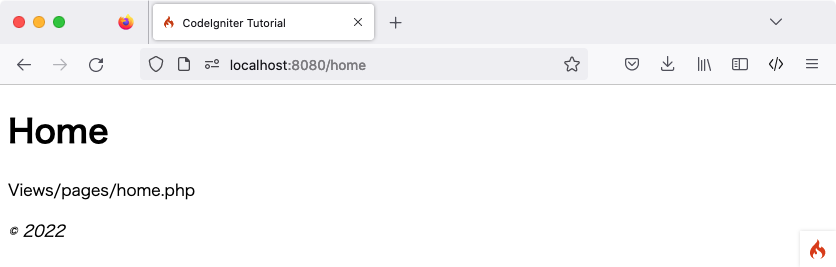

静态页面
############

.. contents::
    :local:
    :depth: 2

.. note:: 本教程假设已下载 CodeIgniter 并在开发环境中 :doc:`安装了框架 <../installation/index>`。

首先需要设置路由规则以处理静态页面。

设置路由规则
*********************

路由用于将 URI 与控制器方法关联。控制器是负责分发工作的类，稍后将进行创建。

开始设置路由规则。打开位于 **app/Config/Routes.php** 的路由文件。

初始状态下，唯一的路由指令应为：

.. literalinclude:: static_pages/003.php

该指令表示，任何未指定内容的入站请求都由 ``Home`` 控制器内的 ``index()`` 方法处理。

在 ``'/'`` 路由指令 **之后** 添加以下代码：

.. literalinclude:: static_pages/004.php
   :lines: 2-

CodeIgniter 自上而下读取路由规则，并匹配第一个符合规则的请求。每条规则都是一个正则表达式（左侧）到控制器及方法名（右侧）的映射。请求进入时，CodeIgniter 会查找首个匹配项，并调用相应的控制器和方法（可能带有参数）。

更多路由信息详见：:doc:`../incoming/routing`。

此处，``$routes`` 对象中的第二条规则匹配 URI 路径为 **/pages** 的 GET 请求，并将其映射到 ``Pages`` 类的 ``index()`` 方法。

第三条规则使用占位符 ``(:segment)`` 匹配 URI 段，并将参数传递给 ``Pages`` 类的 ``view()`` 方法。

创建首个控制器
*******************************

接下来需要设置一个处理静态页面的 **控制器**。控制器是负责分发工作的类，也是 Web 应用的纽带。

创建 Pages 控制器
=======================

在 **app/Controllers/Pages.php** 创建文件并编写以下代码。

.. important:: 务必注意文件名的大小写。许多开发者在 Windows 或 macOS 等不区分大小写的文件系统上开发，但大多数服务器环境区分大小写。如果文件名大小写有误，本地正常运行的代码在服务器上将无法工作。

.. literalinclude:: static_pages/001.php

此处创建了名为 ``Pages`` 的类，其中的 ``view()`` 方法接收名为 ``$page`` 的参数。此外还包含一个 ``index()`` 方法，与 **app/Controllers/Home.php** 中的默认控制器相同，用于显示 CodeIgniter 欢迎页面。

.. note:: 本教程涉及两个 ``view()`` 函数。一个是类方法 ``public function view($page = 'home')``，另一个是用于显示视图的 ``return view('welcome_message')``。从技术角度看它们都是函数，但在类中定义的函数称为“方法”。

``Pages`` 类继承自 ``BaseController``，而 ``BaseController`` 继承自 ``CodeIgniter\Controller``。这意味着新创建的 ``Pages`` 类可以访问 ``CodeIgniter\Controller`` 类（**system/Controller.php**）中定义的方法和属性。

**控制器是所有 Web 请求的核心**。与任何 PHP 类一样，在控制器内部使用 ``$this`` 进行引用。

创建视图
============

创建首个方法后，现在来制作一些基础页面模板。此处将创建两个“视图”（页面模板），分别作为页眉和页脚。

在 **app/Views/templates/header.php** 创建页眉并添加以下代码::

    <!doctype html>
    <html>
    <head>
        <title>CodeIgniter Tutorial</title>
    </head>
    <body>

        <h1><?= esc($title) ?></h1>

页眉包含加载主视图前需要显示的 HTML 基础代码和标题，同时还会输出稍后在控制器中定义的 ``$title`` 变量。接着在 **app/Views/templates/footer.php** 创建页脚并添加以下代码::

        <em>&copy; 2022</em>
    </body>
    </html>

.. note:: **header.php** 模板中使用了 :php:func:`esc()` 函数。这是 CodeIgniter 提供的全局函数，用于防止 XSS 攻击。更多信息请参阅：:doc:`../general/common_functions`。

为控制器添加逻辑
******************************

创建 home.php 和 about.php
=============================

此前已在控制器中设置了 ``view()`` 方法。该方法接收一个参数，即待加载的页面名称。

静态页面主体存放在 **app/Views/pages** 目录。

在该目录下创建 **home.php** 和 **about.php** 两个文件。在文件中随意输入一些内容并保存。如果想随便写点什么，试试"Hello World!"吧。

完善 Pages::view() 方法
=============================

为了加载这些页面，需要检查所请求的页面是否存在。以下是 ``Pages`` 控制器中 ``view()`` 方法的主体逻辑：

.. literalinclude:: static_pages/002.php

在 ``namespace`` 行之后添加 ``use CodeIgniter\Exceptions\PageNotFoundException;`` 以导入 ``PageNotFoundException`` 类。

若请求的页面存在，则连同页眉页脚一起加载并返回。如果控制器返回字符串，该字符串将直接显示给用户。

.. note:: 控制器必须返回字符串或 :doc:`Response <../outgoing/response>` 对象。

若请求的页面不存在，则显示 “404 Page not found” 错误。

方法的第一行用于检查页面是否存在。使用 PHP 原生函数 ``is_file()`` 确认文件是否在预期位置。``PageNotFoundException`` 是 CodeIgniter 的内置异常，会触发 404 错误页面。

在页眉模板中，使用 ``$title`` 变量自定义页面标题。标题的值在此方法中定义，但并非直接赋值给变量，而是赋值给 ``$data`` 数组中的 title 元素。

最后按照显示顺序加载视图。此处使用 CodeIgniter 内置的 :php:func:`view()` 函数，通过第二个参数向视图传递数据。``$data`` 数组中的每个值都会被分配给一个以其键名命名的变量。因此，控制器中的 ``$data['title']`` 对应视图中的 ``$title``。

.. note:: 传给 :php:func:`view()` 函数的文件名和目录名必须与实际的文件系统大小写一致，否则在区分大小写的平台上会报错。详见：:doc:`../outgoing/views`。

运行应用
***************

准备好测试了吗？不能直接使用 PHP 内置服务器运行应用，因为它无法正确处理 **public** 目录下的 **.htaccess** 规则（该规则用于在 URL 中隐藏 “**index.php/**”）。不过 CodeIgniter 提供了专有的运行命令。

在项目根目录下运行：

.. code-block:: console

    php spark serve

这将启动一个可通过 8080 端口访问的 Web 服务器。在浏览器中访问 **localhost:8080** 即可看到 CodeIgniter 欢迎页面。

现在访问 **localhost:8080/home**。路由是否已正确指向 ``Pages`` 控制器的 ``view()`` 方法？非常棒！

页面效果如下图所示：

可以在浏览器中尝试以下 URL，查看 ``Pages`` 控制器的输出结果：

.. table::
    :widths: 20 80

    +---------------------------------+-----------------------------------------------------------------+
    | URL                             | 显示内容                                                        |
    +=================================+=================================================================+
    | localhost:8080/                 | CodeIgniter “欢迎”页面。                                        |
    |                                 | 来自 ``Home`` 控制器的 ``index()`` 方法。                       |
    +---------------------------------+-----------------------------------------------------------------+
    | localhost:8080/pages            | 来自 ``Pages`` 控制器的 ``index()`` 方法，                      |
    |                                 | 显示 CodeIgniter "欢迎" 页面。                                  |
    +---------------------------------+-----------------------------------------------------------------+
    | localhost:8080/home             | 之前创建的 “home” 页面。                                        |
    |                                 | 来自 ``Pages`` 控制器的 ``view()`` 方法。                       |
    +---------------------------------+-----------------------------------------------------------------+
    | localhost:8080/about            | 之前创建的 “about” 页面。                                       |
    +---------------------------------+-----------------------------------------------------------------+
    | localhost:8080/shop             | “404 - File Not Found” 错误页面，                               |
    |                                 | 因为不存在 **app/Views/pages/shop.php**。                       |
    +---------------------------------+-----------------------------------------------------------------+
